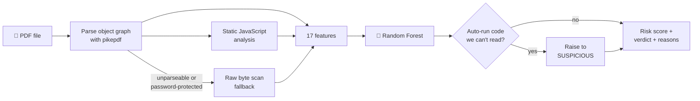

<div align="center">

# 🛡️ PDFShield

**Catch malicious PDFs before anyone opens them.**

A machine-learning classifier that reads a PDF's *internal structure* and *what its JavaScript actually does*
(auto-run triggers, obfuscated code, launch commands, dropped attachments) and tells you how risky it is,
and **why**. It never renders or executes the file.

[](https://github.com/purvalsingh/pdfshield/actions/workflows/tests.yml)


</div>

---

## ✨ Why PDFShield?

- **🧠 A real trained model, not an LLM wrapper.** A scikit-learn Random Forest over 17 features, tested on **22,182 real PDFs including 13,089 real malware samples** (76.2% detected at 1.3% false positives, never having seen real malware in training).
- **📜 Reads the JavaScript, not just its presence.** A form that calculates a total and a dropper that runs `eval(unescape("%u…"))` both "have JavaScript". PDFShield tells them apart.
- **🔍 Explains every verdict.** *"JavaScript uses eval, unescape"*, *"Can launch an external program"*, or *"looks like ordinary form code"*.
- **🔒 Safe by design.** Static analysis only. Nothing is rendered or executed, and the Docker image runs with no network, a read-only filesystem and no privileges.
- **🥷 Handles evasion tricks.** Hex-escaped names (`/J#61vaScript`), code hidden in compressed object streams, broken page trees, truncated files, and password-protected files.
- **⚙️ Scriptable.** JSON output, whole-folder scans, and exit codes you can use to block uploads in a CI pipeline.

## 🚀 Quick start

```bash
git clone https://github.com/purvalsingh/pdfshield.git
cd pdfshield
pip install -e .

pdfshield scan suspicious.pdf
```

That's it. A trained model ships with the repo, so there's nothing else to download.

### 🐳 Or run it in Docker (recommended for untrusted files)

```bash
docker build -t pdfshield .
docker run --rm --network none --read-only --cap-drop ALL \
  -v "$PWD/inbox:/scan:ro" pdfshield scan .
```

The container runs as an unprivileged user with no network and a read-only filesystem,
and your PDFs are mounted read-only, so even a file built to attack the parser has nowhere to go.

## 📖 Usage

### Scan files or whole folders

```bash
pdfshield scan invoice.pdf                 # one file
pdfshield scan report.pdf invoice.pdf      # several files
pdfshield scan ~/Downloads                 # every PDF in a folder, recursively
```

Every file gets one of three verdicts:

| Verdict | Risk score | Meaning |
|---|---|---|
| ✔ **CLEAN** | < 50% | Nothing suspicious found |
| ! **SUSPICIOUS** | 50–80% | Risky or uninspectable content; review before opening |
| ✖ **MALICIOUS** | ≥ 80% | Strong malware indicators; don't open it |

### JSON output (for scripts and dashboards)

```bash
pdfshield scan invoice.pdf --json
```

```json
[
  {
    "file": "invoice.pdf",
    "verdict": "MALICIOUS",
    "risk_score": 1.0,
    "reasons": [
      "JavaScript uses eval, unescape",
      "Runs code automatically when the file is opened (/OpenAction or document-level JavaScript)",
      "Event-triggered actions that execute something (/AA)",
      "..."
    ],
    "features": { "open_action": 1, "js_suspicious_calls": 3, "js_encoded_ratio": 0.1336, "js_max_string_len": 9580, "...": "..." }
  }
]
```

### Use it as a gate in CI or an upload pipeline

`pdfshield scan` exits with a code you can check:

| Exit code | Meaning |
|---|---|
| `0` | All files clean |
| `1` | At least one file flagged |
| `2` | No files found |

```bash
pdfshield scan uploads/ || echo "Rejecting upload: suspicious PDF detected"
```

### Use it from Python

```python
from pdfshield import scan

verdict = scan("invoice.pdf")
print(verdict.label, f"{verdict.score:.0%}")   # MALICIOUS 100%
for reason in verdict.reasons:
    print(" -", reason)
```

### Inspect the raw features

```bash
pdfshield features invoice.pdf
```

### Measure accuracy on your own PDFs

```bash
pdfshield evaluate                                   # held-out + stress tests
pdfshield evaluate --real ~/Documents --output eval.json
```

`--real` scans your own folders and reports the hit rate, next to a simple-rule baseline, plus every file it got
wrong. Files under a folder named `malicious/` count as malicious, and everything else counts as benign.
Pointing it at a folder of your everyday PDFs is the quickest way to see how it does on your kind of documents.

## ⚙️ How it works



1. **Parse, don't render.** [pikepdf](https://github.com/pikepdf/pikepdf) (built on qpdf) walks every object in the file, including actions nested inside other objects and objects packed into compressed streams.
2. **Classify each action by what it does.** "Open at page 1" and links to other PDFs are navigation. JavaScript, launching `cmd.exe`, or opening `\\host\share` (which leaks Windows credentials) are execution.
3. **Analyze the JavaScript statically.** It's never executed. PDFShield counts exploit and dropper calls, measures how much of the code is escape-encoded, and looks for long, dense, random-looking strings.
4. **Classify** with a Random Forest (200 trees, depth 8).
5. **Apply one policy rule.** If code runs automatically but can't be read (password-protected, or only ciphertext left), the file is raised to SUSPICIOUS rather than guessed clean.
6. **Explain** every red flag, and say so when JavaScript looks like ordinary form code.

### The 17 features

| Group | Features | What they catch |
|---|---|---|
| **Triggers** | `open_action`, `additional_actions` | Code that runs on open, or on page/field events, without a click |
| **Payloads** | `launch_action`, `embedded_file_count`, `javascript_count` | Programs launched, files dropped, scripts present |
| **JavaScript content** | `js_suspicious_calls` | `eval`, `unescape`, `String.fromCharCode`, string timers, `exportDataObject`, and Acrobat APIs abused by past exploits (`util.printf`, `Collab.getIcon`, `media.newPlayer`…) |
| | `js_network_calls` | `launchURL`, `submitForm`, `getURL`… (a weaker signal, since real forms use them too) |
| | `js_encoded_ratio`, `js_entropy`, `js_max_string_len`, `js_length` | Obfuscation: `%u4141`/`\x41` escapes, packed payload strings |
| **Context** | `acroform`, `xfa`, `uri_count`, `encrypted` | Common in *both* benign and malicious files |
| **Shape** | `page_count`, `object_count`, `file_size_kb` | Document size |

## 📊 Model performance

All results below are reproducible with `pdfshield train && pdfshield evaluate`. The same pipeline runs from a clean
checkout in a fresh `python:3.12-slim` container and in CI.

### Headline numbers

| Test set | Result | Simple-rule baseline¹ |
|---|---|---|
| **Real-world benign PDFs** (281 files) | **97.9%** correctly clean | 96.8% |
| Held-out synthetic (1,000 unseen files) | **100%** · ROC-AUC 1.000 | 88.8% |
| Training cross-validation (5-fold F1) | 0.992 ± 0.006 | – |
| **Real malware** (CIC-Evasive-PDFMal2022, 22,182 files) | **76.2%** detected at **1.3%** false positives · ROC-AUC 0.963 · [details](#-real-malware-benchmark) | – |

¹ *"Flag it if it has JavaScript, an automatic trigger, or a launch action."* Reported side by side so it's clear what the model adds.

### Real-world PDFs

The corpus is **281 unique benign PDFs**: every test fixture shipped in the pikepdf, PyMuPDF and pypdf source packages,
plus 2 PDFs from the build machine. They include tax forms full of calculation scripts, Adobe LiveCycle XFA forms,
password-protected files, broken page trees and patent documents.

| Version | Wrongly flagged | Accuracy |
|---|---|---|
| Structure-only model (before JavaScript analysis) | 13 / 281 | 95.4% |
| **Current model** | **6 / 281** | **97.9%** |

The 6 remaining misses are all borderline (51–54%, SUSPICIOUS, never MALICIOUS): five Adobe LiveCycle XFA forms
with Adobe's "download the latest Reader" script, and one heavily scripted government form.

> **Honest caveat:** I used this corpus for error analysis while building the JavaScript features (that's how
> the misses above were found), so it acts as a development set and 97.9% is somewhat optimistic. It also
> contains **no real malware**, so it measures false positives only. See [Limitations](#%EF%B8%8F-limitations).

### Stress tests (cases outside the training distribution)

| Case | True label | What it tests | Result |
|---|---|---|---|
| Obfuscated names | malicious | `/J#61vaScript`-style hex escapes | ✅ 50/50 |
| Object streams | malicious | Actions hidden in compressed object streams | ✅ 50/50 |
| Large malicious | malicious | 40–80 pages, far outside training size range | ✅ 50/50 |
| Click-triggered JS | malicious | Obfuscated JavaScript on a link click, no auto-trigger | ✅ 48/50 |
| Truncated file | malicious | Cut off mid-file; parts of the payload are lost | ✅ 45/50 |
| Remote GoToR² | malicious | Opens `\\host\share` on open (NTLM credential leak) | ✅ 50/50 |
| Password-protected | malicious | Contents unreadable without the password | ⚠️ 41/50 |
| Password-protected | benign | Contents unreadable without the password | ⚠️ 39/50 |
| Truncated benign | benign | Broken files must not *look* malicious | ✅ 50/50 |
| Large benign | benign | 40–80 pages | ✅ 50/50 |
| Calculating form | benign | Legitimate field-level JavaScript (was the known false positive) | ✅ 1/1 |

² Scored **0/50** when first tested. The attack was then added to the training data, so this row is no longer unseen.

Password-protected files are a deliberate trade-off. If a locked file runs code on open, PDFShield flags it for
review, because it can't read that code. Attackers lock PDFs on purpose (the password goes in the email) to get
past scanners.

Full reports: [`report.json`](pdfshield/model/report.json) (training) and
[`evaluation.json`](pdfshield/model/evaluation.json) (held-out, stress and real-world, file by file).

## 🦠 Real-malware benchmark

**Dataset:** [CIC-Evasive-PDFMal2022](https://www.unb.ca/cic/datasets/pdfmal-2022.html) (Canadian Institute for
Cybersecurity), downloaded 26 Sep 2026. After SHA-256 deduplication: **13,089 unique malicious + 9,093 unique benign
PDFs.** Run in a disposable, memory-only sandbox with no network (see [how it was run](docs/REAL_MALWARE_BENCHMARK.md#how-this-run-was-done)).

### As shipped: the headline number

The bundled model, trained **only on synthetic data**, had never seen a single real malicious PDF:

| Metric | Result |
|---|---|
| **Detection rate (recall)** | **76.2%** (9,973 / 13,089 · 95% CI 75.5–76.9%) |
| **False-positive rate** | **1.3%** (120 / 9,093 · 95% CI 1.1–1.6%) |
| Precision | 98.8% |
| ROC-AUC | 0.963 |

Of the malicious files, 8,460 were rated MALICIOUS, 1,511 SUSPICIOUS, and 3,116 missed. Two files crashed the parser
and are counted as flagged; none timed out.

| Threshold | Recall | False-positive rate |
|---|---|---|
| 0.3 | 79.4% | 3.1% |
| **0.5 (default)** | **76.2%** | **1.3%** |
| 0.6 | 69.4% | 0.11% |
| 0.8 (MALICIOUS) | 64.7% | 0.03% |

### Retrained on the real data (5-fold cross-validation)

The same features and model, trained on CIC data (train and test folds never share a file):

| Features | Recall | False-positive rate |
|---|---|---|
| All 17 | **96.3% ± 0.5%** | 0.19% ± 0.11% |
| Without file size / object / page count | 95.0% ± 0.6% | 3.55% ± 0.27% |

The second row is there because CIC's malicious files are much smaller than its benign ones (median 9.5 KB vs
74 KB), and the retrained model uses file size as its top feature. That size gap is a property of the dataset, not
of malware, so the size-free row is the more honest estimate of the features' power: **95% recall at ~3.5% false
positives.**

### What it misses, and why

| Missed malicious files (3,116) | Share | Cause |
|---|---|---|
| Embedded files / XFA forms, no JavaScript found | 38% | **XFA forms keep their JavaScript in XML `<script>` blocks**, which the extractor doesn't read yet. 41% of all misses are XFA |
| No scripts, actions or attachments at all | 25% | Exploits in fonts, images or other streams, outside what these features can see |
| JavaScript + auto-trigger, but content scored benign | 21% | Obfuscation styles the synthetic generator never produced |
| JavaScript without an auto-trigger | 16% | Synthetic training malware always auto-ran |

The 120 false positives are mostly Adobe XFA/LiveCycle forms (70% XFA, 72% with embedded files): the same pattern
found in the benign-only real-world test.

Per the [protocol](docs/REAL_MALWARE_BENCHMARK.md), no feature, threshold or training data was changed after
seeing these results. Fixes (XFA script extraction first) will be measured on a **different** corpus.
Full reports: [`docs/results/cic-evasive-pdfmal2022/`](docs/results/cic-evasive-pdfmal2022/).

**Reproduce it:** `scripts/benchmark.sh malicious.zip benign.zip results/ "CIC-Evasive-PDFMal2022"`

## ⚠️ Limitations

- **Misses about 1 in 4 real malicious PDFs (as shipped).** Mainly XFA-based samples (script hidden in XFA XML,
  not yet extracted) and exploits with no scripting at all. See the [real-malware benchmark](#-real-malware-benchmark).
- **One corpus.** The real-malware numbers are for CIC-Evasive-PDFMal2022. Detection rates don't automatically
  transfer to other malware collections.
- **Synthetic malware is only as varied as its generator.** The model has seen the obfuscation styles in
  `jsgen.py`. A novel style, or malicious code written to look like plain form code, may score low.
- **Static analysis can't see runtime behavior.** Code assembled at runtime from form-field values or
  annotations can hide from pattern matching.
- **Password-protected files can't be inspected.** If one runs code on open it is flagged for review
  (see above), which also flags some legitimate locked forms.
- **Structure and JavaScript only.** Exploits in fonts, images or other streams that need no scripting
  won't trip these features.

## 🗺️ Roadmap

- [x] Static analysis of JavaScript content (suspicious calls, encoding, entropy, packed strings)
- [x] Evaluation on real-world PDFs, with a simple-rule baseline
- [x] Docker image that scans in a locked-down, network-less container
- [x] Evaluation suite: held-out set, stress tests, rule baseline, real-world files
- [x] Sandboxed real-malware benchmark harness (dedup, timeouts, confidence intervals, fixed protocol)
- [x] Run it on CIC-Evasive-PDFMal2022 and publish the result (76.2% recall at 1.3% FPR, as shipped)
- [ ] Extract JavaScript from XFA `<script>` blocks (the largest cause of misses), then measure on a different corpus
- [ ] Stream-level features: filter chains, entropy, suspicious fonts and images
- [ ] De-obfuscate JavaScript statically (unwrap `unescape`/`fromCharCode` layers) before analysis
- [ ] REST API for upload scanning

## 🗂️ Project layout

```
pdfshield/
├── pdfshield/
│   ├── features.py     # structural features, action classification, byte-scan fallback
│   ├── jsanalysis.py   # static JavaScript analysis (never executes anything)
│   ├── jsgen.py        # realistic benign + inert obfuscated JavaScript for training
│   ├── samples.py      # benign / malicious PDF builders
│   ├── train.py        # dataset generation, training, training report
│   ├── evaluate.py     # held-out, stress-test and real-world evaluation
│   ├── benchmark.py    # real-malware benchmark: isolation, dedup, confidence intervals
│   ├── model.py        # scoring, inspection policy, explanations
│   ├── cli.py          # `pdfshield` command
│   └── model/          # trained model + report.json + evaluation.json
├── scripts/benchmark.sh  # runs the benchmark in a locked-down container
├── tests/              # pytest suite (33 tests)
├── docs/
│   ├── ENGINEERING_NOTES.md
│   ├── REAL_MALWARE_BENCHMARK.md
│   └── demo.svg
└── Dockerfile
```

## 🤝 Development

```bash
pip install -e ".[dev]"
pytest -v
```

If scikit-learn warns that the bundled model came from a different version, run `pdfshield train` to rebuild it locally.

## 📄 License

[MIT](LICENSE) © Purval Singh
