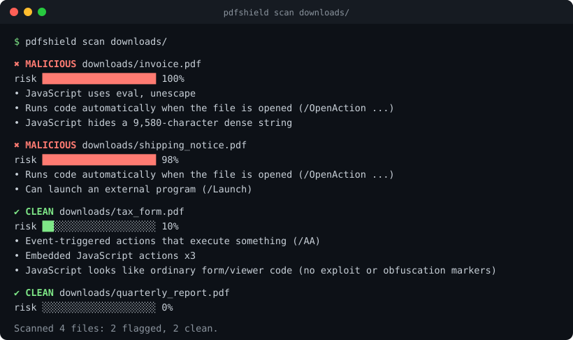
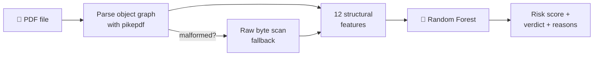

<div align="center">

# 🛡️ PDFShield

**Catch malicious PDFs before anyone opens them.**

A machine-learning classifier that reads a PDF's *internal structure* (auto-run actions, hidden JavaScript,
launch commands, embedded files) and tells you how risky it is, and **why**. It never renders or executes the file.

[](https://github.com/purvalsingh/pdfshield/actions/workflows/tests.yml)




</div>

---

## ✨ Why PDFShield?

- **🧠 A real trained model, not an LLM wrapper.** A scikit-learn Random Forest trained on 12 structural features, with a full evaluation report.
- **🔍 Explains every verdict.** Each result lists the concrete red flags it found, like *"Runs an action automatically when the file is opened"*.
- **🔒 Safe by design.** Static analysis only. The PDF is parsed, never opened in a viewer, so a malicious file can't run anything.
- **🥷 Handles evasion tricks.** Obfuscated names such as `/J#61vaScript` are decoded, and malformed or truncated files fall back to a raw byte scan.
- **⚙️ Scriptable.** JSON output, whole-folder scans, and exit codes you can use to block uploads in a CI pipeline.

## 🚀 Quick start

```bash
git clone https://github.com/purvalsingh/pdfshield.git
cd pdfshield
pip install -e .

pdfshield scan suspicious.pdf
```

That's it. A trained model ships with the repo, so there's nothing else to download.

## 📖 Usage

### Scan files or whole folders

```bash
pdfshield scan invoice.pdf                 # one file
pdfshield scan report.pdf invoice.pdf      # several files
pdfshield scan ~/Downloads                 # every PDF in a folder, recursively
```

Every file gets one of three verdicts:

| Verdict | Risk score | Meaning |
|---|---|---|
| ✔ **CLEAN** | < 50% | No suspicious structure found |
| ! **SUSPICIOUS** | 50–80% | Some risky structure; worth a closer look |
| ✖ **MALICIOUS** | ≥ 80% | Strong malware indicators; don't open it |

### JSON output (for scripts and dashboards)

```bash
pdfshield scan invoice.pdf --json
```

```json
[
  {
    "file": "invoice.pdf",
    "verdict": "MALICIOUS",
    "risk_score": 1.0,
    "reasons": [
      "Runs an action automatically when the file is opened (/OpenAction)",
      "Can launch an external program or file (/Launch)"
    ],
    "features": { "page_count": 2, "javascript_count": 0, "open_action": 1, "launch_action": 1, "...": "..." }
  }
]
```

### Use it as a gate in CI or an upload pipeline

`pdfshield scan` exits with a code you can check:

| Exit code | Meaning |
|---|---|
| `0` | All files clean |
| `1` | At least one file flagged |
| `2` | No files found |

```bash
pdfshield scan uploads/ || echo "Rejecting upload: suspicious PDF detected"
```

### Use it from Python

```python
from pdfshield import scan

verdict = scan("invoice.pdf")
print(verdict.label, f"{verdict.score:.0%}")   # MALICIOUS 100%
for reason in verdict.reasons:
    print(" -", reason)
```

### Inspect the raw features

```bash
pdfshield features invoice.pdf
```

## ⚙️ How it works



1. **Parse, don't render.** [pikepdf](https://github.com/pikepdf/pikepdf) (built on qpdf) walks every object in the file, including actions nested directly inside other objects, without ever executing content.
2. **Extract 12 features** that malware analysts look for:

   | Feature | What it catches |
   |---|---|
   | `open_action` | Something runs the moment the file opens |
   | `additional_actions` | Actions fired by events: page view, field change, close |
   | `javascript_count` | Embedded JavaScript, the most common exploit vector |
   | `launch_action` | Attempts to start an external program |
   | `embedded_file_count` | Dropped payloads hidden as attachments |
   | `xfa` | XFA forms, a frequent target of reader exploits |
   | `acroform`, `uri_count`, `encrypted` | Context: common in *both* benign and malicious files |
   | `page_count`, `object_count`, `file_size_kb` | Document shape |

3. **Classify** with a Random Forest (200 trees, depth 8), which turns the features into a probability of being malicious.
4. **Explain** by listing each red flag present in the file.

## 📊 Model performance

Trained on 1,200 generated PDFs (600 benign, 600 malicious-structured) with a stratified 75/25 split:

| Metric | Result |
|---|---|
| 5-fold cross-validated F1 | 1.000 ± 0.000 |
| Test precision / recall | 1.000 / 1.000 |
| Test confusion matrix | 150 TN · 0 FP · 0 FN · 150 TP |

**Top features:** `javascript_count` (0.39), `additional_actions` (0.24), `open_action` (0.23), `launch_action` (0.09), `embedded_file_count` (0.02).

The full report is in [`pdfshield/model/report.json`](pdfshield/model/report.json).

> **Read the perfect score with care.** The malicious class is *defined* by having an automatic trigger,
> so clean separation is expected on this data. It shows the pipeline learns the right signals. It does
> **not** mean 100% accuracy on real-world malware. See [Limitations](#%EF%B8%8F-limitations).

### Bugs the evaluation caught

Two data problems were found and fixed before this model was trusted:

1. **File size was the top feature.** The first malicious samples were blank pages while benign ones held
   real text, so the model learned "small file = malware". Malicious samples now carry the same kind of
   realistic content as benign ones.
2. **"Encrypted" and "has links" leaked the label.** Re-saving with pikepdf dropped encryption, and links
   nested inside annotations weren't counted. After fixing both, encryption, links, forms and attachments
   appear in *both* classes, so only the genuinely dangerous mechanisms separate them.

## 🧪 The training data (and why no live malware)

The training corpus is **synthetic but structurally real**:

- **Benign** PDFs are generated with reportlab: 1 to 12 pages of text, shapes, hyperlinks, forms, legitimate attachments, and encryption, all in varied combinations.
- **Malicious** PDFs start as the same kind of normal-looking document. Then the structural markers of real PDF malware are injected: `/OpenAction` or `/AA` auto-triggers carrying JavaScript or `/Launch` actions, dropped `.exe`/`.vbs`/`.scr` attachments, and extra JavaScript name trees.

The injected JavaScript is an inert placeholder and there is **no exploit code anywhere in this repository**.
Handling live malware samples safely needs an isolated lab, so this project deliberately learns from structure
instead. That structure is exactly what real malware shares with these samples.

Regenerate the data and retrain in about 15 seconds:

```bash
pdfshield train                          # 600 + 600 samples, seed 42
pdfshield train --benign 2000 --malicious 2000 --seed 7
```

## ⚠️ Limitations

Being upfront about what this can't do:

- **Legitimate interactive forms get flagged.** A form that auto-calculates a total with JavaScript uses the
  same `/AA` + JavaScript mechanism as malware, and PDFShield flags it. This is a real, tested false positive
  (`test_known_false_positive_calculating_form`). The fix is on the roadmap: analyze *what* the script does,
  not just that it exists.
- **Synthetic training data.** Real-world PDFs are noisier. Before production use, retrain on a labeled corpus
  such as [Contagio](https://contagiodump.blogspot.com/) or [CIC-Evasive-PDFMal2022](https://www.unb.ca/cic/datasets/pdfmal-2022.html),
  handled inside a sandbox.
- **Structure, not behavior.** A PDF that exploits a parser bug with no scripting (for example, a malformed
  font or image stream) won't trip these features.

## 🗺️ Roadmap

- [ ] Static analysis of JavaScript content (`eval`, `unescape`, heap-spray patterns, obfuscation entropy)
- [ ] Stream-level features: filter chains, entropy, suspicious fonts and images
- [ ] Retrain and benchmark on a public real-malware dataset
- [ ] REST API and Docker image for upload scanning

## 🗂️ Project layout

```
pdfshield/
├── pdfshield/
│   ├── features.py     # structural feature extraction (+ byte-scan fallback)
│   ├── samples.py      # benign / malicious-structured PDF builders
│   ├── train.py        # dataset generation, training, evaluation report
│   ├── model.py        # model loading, scoring, explanations
│   ├── cli.py          # `pdfshield` command
│   └── model/          # trained model + report.json
├── tests/              # pytest suite, including the known false positive
└── docs/demo.svg
```

## 🤝 Development

```bash
pip install -e ".[dev]"
pytest -v
```

If scikit-learn warns that the bundled model came from a different version, run `pdfshield train` to rebuild it locally.

## 📄 License

[MIT](LICENSE) © Purval Singh
